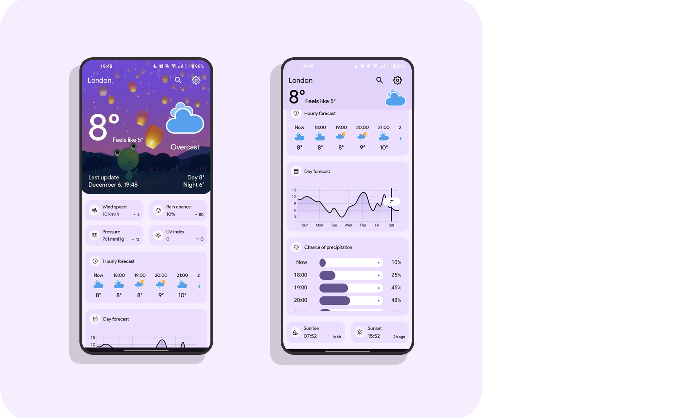

 

    

<h1 align="center">WeatherApp</h1>

        <h3 align="center">This is a Java-based weather forecast app for Android. It collects weather data from 
<a href="https://open-meteo.com/">OpenMeteo</a> and <a href="https://www.geonames.org/">GeoNames</a> public api
            to search and retrieve data about localities</h3>

The app design is based on a mockup from <a href="https://www.figma.com/community/file/1249443729401540968/google-weather-app-redesign">Figma</a>

## Features

- 🌡 Displays current, hourly and daily weather forecasts
- 🌅 Shows sunrise/sunset times with relative time difference
- 🌍 Supports temperature, pressure and wind speed units
- 🗺 Geolocation-based weather data
- 🌐 Supports multiple languages
- 🔍 Search for localities

## Screenshots

## Demonstration
https://github.com/user-attachments/assets/68beefd5-d197-4094-bb69-ef21f154f1b4

## Requirements

- Android studio latest version
- JDK 8
- Android SDK 34
- Supports API Level +21
- Create an account on GeoNames and specify the username in the GeoNamesClient file (myName field)

## Installing

The application is available for download in <a href="https://github.com/Wemaka/WeatherApp/releases">releases</a>
